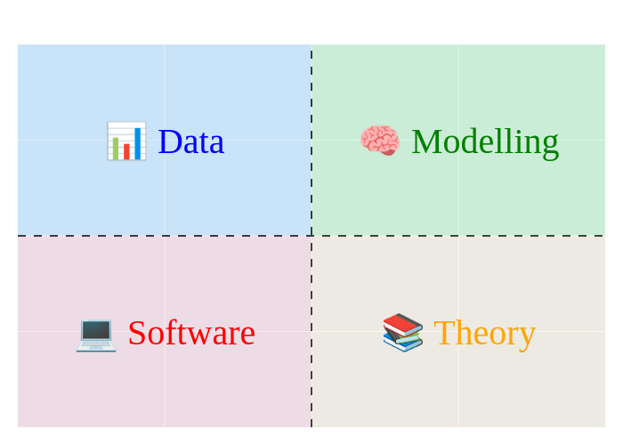

## 🔍 Finding a project

The first step in writing a thesis is to find a project to work on. The four most common ways are:

1. Find a project at a company, maybe where you are working as a student assistant
2. Find a project through <https://dtu.jobteaser.com>
3. Propose a project yourself
4. Contact a professor or researcher at DTU for project ideas

Regardless of what way you find a project, it is important that you find a project that you are interested in! You will
be working on the project for 5+ months and burnout is a real thing. So, even if you are not in charge of formulating
the initial project idea, you can still influence the project during the process to make it more interesting for you.
Remember, in the end it is your thesis 🎓

When considering project, think about what parts of computer science that you find most interesting. Very broadly, a
thesis within computer science can be divided into four categories(1)
{ .annotate }

1. :man_raising_hand: Yes, this is a brute simplification of the field of computer science, but it is a good way to
    think about what you find interesting and in my experience is still fairly covering.

<figure markdown="span">
  { width="300" }
</figure>

1. **Theory**: This is the mathematical and theoretical part of computer science. It is about understanding the
    fundamental limits of computation and algorithms. If you like math and theory, this is the place for you.

2. **Software**: This is about understanding and working with software. It is about understanding how to design, build
    and maintain software. If you like programming and software development, this is the place for you.

3. **Data**: This is about understanding and working with data. It is about understanding how to store, process and
    analyze data. If you like working with data, this is the place for you.

4. **Modelling**: This is about understanding and working with complex systems. It is about understanding how to model
    and simulate systems. If you like understanding complex systems, this is the place for you.

You will most likely be working with a combination of these four categories, but it is a good idea to think about what
you find most interesting. For example, if you are doing a project in the field of machine learning, you will most
likely be working with data and modelling as the primary focus. That said, you can put more focus on software by
implementing not just a model but a hole ML system and in the same way you can put more focus on theory by
understanding the theoretical limits of the model you are using.

## 🧙‍♂️ Finding a supervisor

Regardless of how you find a project, you need a supervisor from DTU to register the project and guide you through the
project (yes, also for company projects). The DTU rules state that:

!!! note "Main supervisor"

    The main supervisor for a master's thesis must

    * Be an employee at DTU as a VIP with research obligations and one of the following job categories: assistant
        professor, associate professor, researcher, senior researcher, senior adviser, or professor,

    * Hold a permanent position (with the exception of assistant professors and researchers)

    * Have completed DTU's course 'Supervision of larger projects at DTU' or similar pedagogical competence development
        at the university level e.g. a course in PhD supervision; for assistant professors, however, it is sufficient
        that one is in the process of UDTU, and

    * Have in-depth knowledge of the study conditions at DTU.

So not all employees at DTU can be your *main-supervisor*. That being said, if you find a supervisor that does not
meet the above criteria (PhD student, Postdoc or tenure-track assistant professor) it is possible that they can still
supervise you, as long as you find a college that meets the above criteria to be your *main-supervisor* on paper.

If you are doing a company project, you will also need a co-supervisor from the company. The co-supervisor does not
officially hold any responsibilities, but they are very much expected to help you with the practicalities of the project
and provide you with the necessary data and information.

## 👓 Read the rules

Yes, it is super boring to read the rules, but it is important to know what you are getting into and you can often
find questions to a lot of the questions you might have. So take your time to read them at least once. The rules may
differ a bit from studyline to studyline, so make sure you read the rules for your studyline, which you can find here:

<https://student.dtu.dk/en/programme-specifications>

Especially, be aware of learning objectives for your thesis, as they are the basis for the assessment of your thesis.
They will look something like this:

!!! note "Learning objectives"

    A graduate of the MSc programme from DTU:

    * can identify and reflect on technical scientific issues and understand the interaction between the various
        components that make up an issue
    * can, based on a clear academic profile, apply elements of current research at an international level to develop
        ideas and solve problems
    * masters technical scientific methodologies, theories, and tools, and can take a holistic view of and delimit a
        complex, open issue, put it into a broader academic and societal perspective, and, on this basis, propose a
        variety of * possible actions while considering sustainability
    * can develop relevant models, systems, technologies, and processes aimed at solving technological problems
    * can communicate and mediate research-based knowledge both orally and in writing
    * is familiar with and can seek out leading international research within their specialist area.
    * can work independently and reflect on own learning, academic development, and specialization
    * masters technical problem-solving at a high level through cross-disciplinary teamwork, and can work with and
        manage all phases of a project – including preparation of timetables, design, solution, and documentation

All these learning objectives are fairly *meta*, but they can interpret as you need to master every aspect of doing
a thesis from the technical aspects to the communication and project management.

## 💾 Registering the project

The project needs to be officially registered by your supervisor to DTU study administration. In practice this should
be done about two weeks before you start the work. For your supervisor to register the project they need some
[information](include/DTUs_projektindberetning.pdf).

!!! note "Registration information"

    * **Title**: The overall title for the project

    * **Description**: A short (5-10 lines) description of the project, that motivates the project and gives an overview
        of the work to be done. You do not fix the project description in stone, but it is a good idea to have a clear
        idea of what you want to do.

    * **Number of ECTS**: You can do the thesis for 30, 32.5 or 35 ECTS. The default is 30 ECTS.

    * **Start date**: The date you start working on the project. If you start in the spring, you are expected to start
        either in the first week of january or if you are having a 3 weeks course, then the first week after 3 weeks
        period have ended. Similarly, if you start in the fall, you are expected to start in the first week of August or
        the end of August depending on if you have a 3 weeks course in June. That said, you can register on alternative
        days but you need to provide a reason for it.

    * If **company project** please also provide:
        * Company name
        * Company address
        * Company contact person
        * Company contact email
        * Company contact phone number

    * **Student information**: Your student number and if it is a group project, the student number of your group
        members.

    * **Supervisor information**: If you have more than one supervisor, you need to provide the email-initials of the
        ones that are not registering the thesis.

Note that the title and description should be provided in both Danish and English.

## 🗣️ Setting expectations

As the final step before starting the project, you should set expectations with your supervisor. This is important to
make sure that you are on the same page and that you know what is expected of you. Consider the following questions:

* What is the expected outcome of the project?

* What grade do you expect to get?

* What should the meeting schedule be? Regular vs. ad-hoc meetings? Physical vs. online meetings?

* What means of communication should be used? Email, Teams, Slack, etc.?
