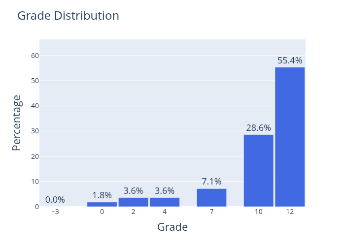

Yeah, you are nearly there. You handed in the thesis and you are only missing the defense. But what are the actual
rules and format? Here is a short overview:

The defense is a 1 hour examination of your project where you supervisor, co-supervisors if any, and a censor will
be present. You are free to invite friends and family to the defense. The format is usually like this:

!!! note "The censor & and defense date"

    Finding a censor is not your responsibility, it is your supervisors job. The censor is a external examiner
    (non-DTU person) that hopefully has some experience in the field of your project.

    The date of your defence date should take place no more than 2 weeks (10 working days) after you hand in your
    thesis. That said, it is not uncommon that a censor is not available and the defense is postponed a bit. You can
    make requests for the date, but in the end you need to be available for the date censor and your supervisor has
    time for. That said, if you have specific dates in mind talk with your supervisor early on.

1. 20-25 min presentation of your project. You simply create a power-point or similar and present what you have done
    throughout the project. Some advice to follow

    !!! note "Slides"

        * You should more or less follow the structure of the thesis, but I would recommend that you
            focus more on the parts of the project that is truly your work. By this I mean that you should not spend too
            much time on the motivation and background but instead of your results and discussion.

        * If you have a product to show, like a demo of some software you have written, this should be included in the
            presentation.

        * Never have more slides than minutes you have. 1 minute per slides is a good rule of thumb, that balance
            not having slides that are way to complex and slides you just click through.

        * The slides are there to support your presentation, not be the presentation. Therefore, make sure you are
            not just reading the slides. Instead, add notes to the slides that you can use to remember what to say.

2. 20-25 min of questions from censor and supervisor. Do not think of this part of the defense as a test. It is more
    like a discussion where you either get questions to elaborate on your work or you get questions that are meant to
    challenge your work. This is very much a discussion instead of you just answering questions.

3. 10 min of grading. You (together with friends and family) will be asked to leave the room and you need to take all
    your belongings with you. Supervisor and censor then discuss what grade you should get. As a rule of thumb you can
    expect that the majority of the grade is based on your report and the presentation is often used to determine which
    grade you should get if you are on the edge between two grades.

4. You get pulled in (without friends and family) and you are told the grade. You will most likely be given some
    feedback for you to understand why you got the grade you got.

Finally, you should not be nervous. You have done the work, and you know your project better than anyone else. Just be
honest and open, and you will do fine. In general, students tend to get good grades, see figure below.

<figure markdown="span">
    { width="500" }
    <figcaption>Grade distribution for BsC and MsC projects supervised by the author.</figcaption>
</figure>

That's it. You are now either a Bachelor or a Master of Science. Congratulations 🎉
