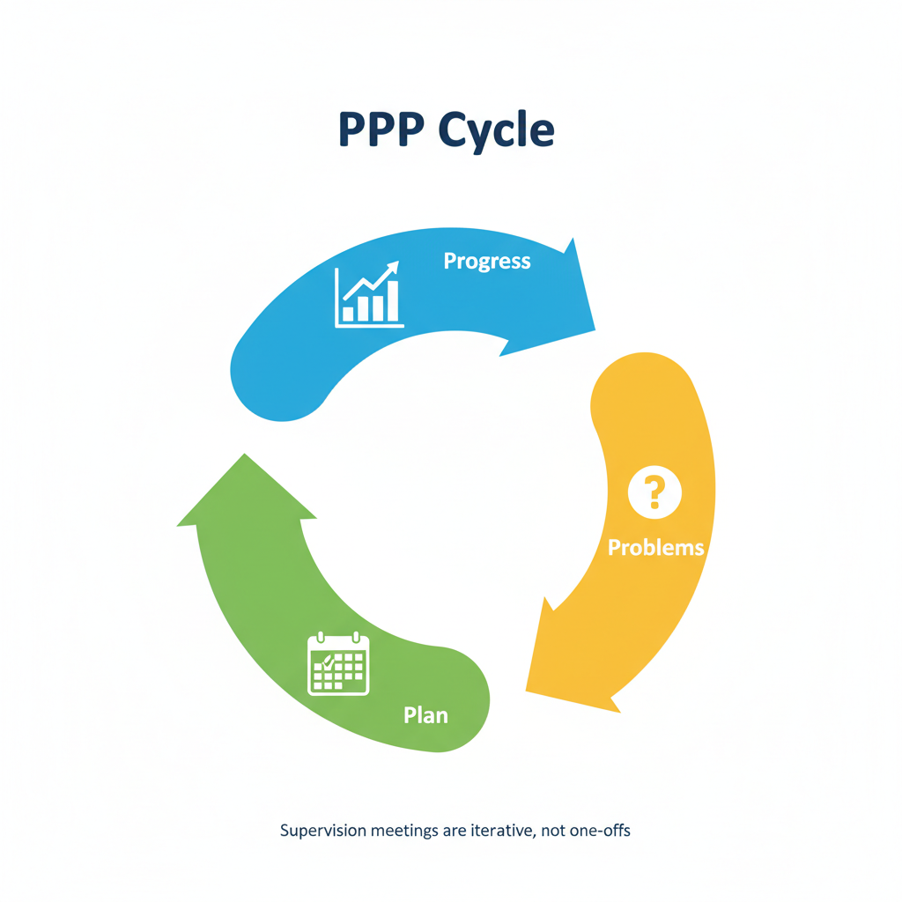

I cannot stress enough how important it is to have meetings with your supervisor from time to time. The only cases I
have observed where the student have failed the thesis (or close to fail) is when the student either do not care about
their supervisor's input or when they believe that they can do everything on their own. We are here to help you, but
it is your responsibility to reach out and ask for help when needed.

Depending on who your supervisor is, the supervision meetings may be organized differently. A couple of examples:

1. **Frequent meetings**: Supervisor *A* prefer close to weekly meetings to make sure that the student is on track at
    all times. The meetings are typically 30 minutes long, and the student is expected to prepare a short agenda for
    each meeting.

2. **Bi-weekly meetings**: Supervisor *B* prefer bi-weekly meetings, usually 1 hour long. This gives the possibility for
    the student to work more independently, but also means that the student needs to be better at planning their work.
    The student is expected to prepare a short agenda for each meeting.

3. **Ad-hoc meetings**: Supervisor *C* prefer ad-hoc meetings e.g. no fixed meeting schedule. It is fully up to the
    student to book meetings when needed. This requires that the student is very good at planning their work, and also
    at asking for help when needed. The student is expected to prepare a short agenda for each meeting.

4. **Group-based meetings**: Supervisor *D* prefer group-based supervision meetings, where several students meet with
    the supervisor at the same time. This has the benefit that students can help each other, and also learn from each
    other. The meetings are typically bi-weekly, 2 hours long, and the students are expected to prepare a short agenda
    for each meeting.

Regardless of the supervision style, you can see that in all cases the supervisor expects that you come prepared to the
meeting. A good mental model for supervision meetings are the PPP model:

* **Progress**: what have you done since the last meeting? You should prepare and show tangible artifacts that you have
    worked on. This can be the project plan, a literature review, some UX design, a software architecture, code, a
    running demo, or even some hardware setup.

* **Problems**: what problems, challenges, or questions do you have? What do you want to have your supervisor's input
    on? If it has to do with details in a paper, some specific code etc. it is in most cases a good idea to send this to
    your supervisor ahead of the meeting, so that they have time to prepare.

* **Plan**: what do you plan to work on for the next X-week period? Do you need the supervisors help at any time in
    between supervision meetings? What are your next milestones?

<figure markdown="span">
  { width="500" }
</figure>

Supervisors are different in how they want to meet, ask if meetings should be physical or online or a mix.
