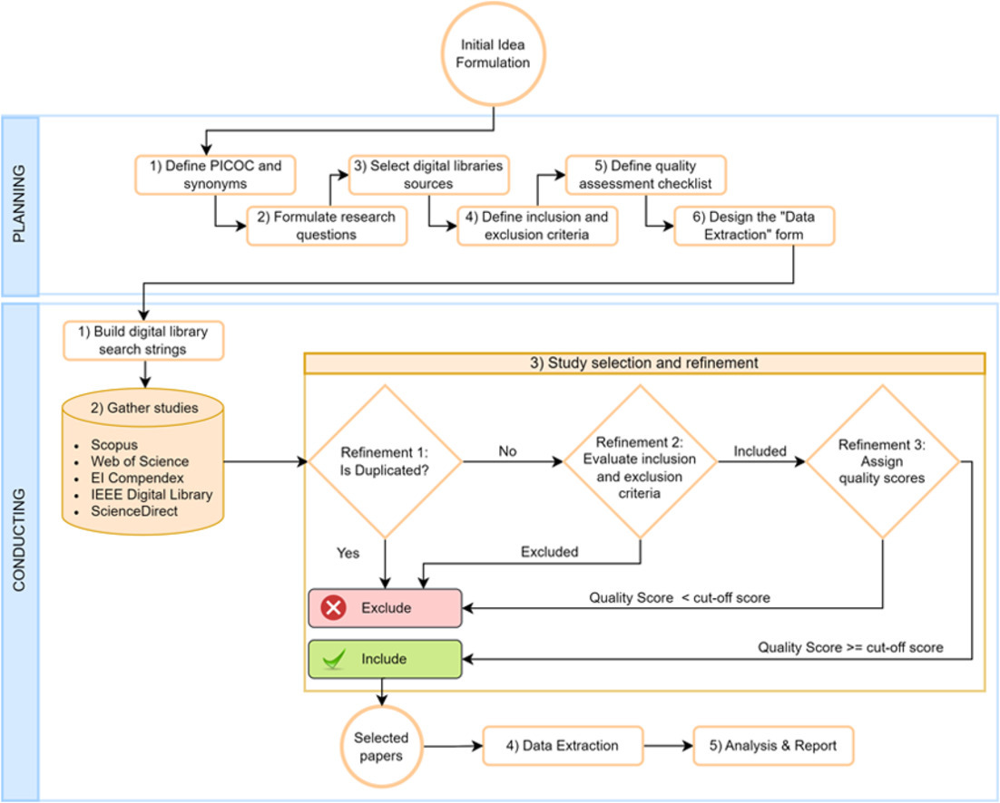

Alright, you have now started the thesis. What do to next?

## 🟢 The first month

The first month of the thesis depends a lot on the project you are doing. If the project is very well-defined you will
find that you can start coding and analyzing data right away. However, in most cases you will need to spend some time
reading literature and getting a better understanding of the problem you are trying to solve. This is completely normal,
and you should not be worried about it. In general expect to

1. Read literature

2. Begin analyzing data

3. Write some initial code

When you are closing in on the first month you need to hand-in a project plan.

!!! note "Thesis template"

    If you want a barebone thesis template to get started with I have created one that is included in this repository.
    It is a [cookiecutter](https://cookiecutter.readthedocs.io/en/latest/) template that you can use to create a new
    thesis project by running the following command in your terminal:

    ```bash
    pip install cookiecutter
    cookiecutter https://github.com/SkafteNicki/dtu_cs_thesis
    ```

    and answer the questions in the terminal. It contains a basic structure for the thesis, your project plan and
    general code structure. For full reproducibility, it also contains a
    [devcontainer](https://code.visualstudio.com/docs/devcontainers/create-dev-container) setup that will automatically
    install all the dependencies needed to run code and write the thesis.

    ??? example "Template structure"

        ```bash
        project_name/
        ├── .devcontainer
        │   ├── devcontainer.json
        │   └── post_create.sh
        ├── .gitignore
        ├── LICENSE
        ├── notebooks
        │   └── .gitkeep
        ├── .pre-commit-config.yaml
        ├── project_plan
        │   ├── bibliography.bib
        │   ├── main.pdf
        │   ├── main.tex
        │   ├── time_plan.ods
        │   └── time_plan.png
        ├── pyproject.toml
        ├── README.md
        ├── scripts
        │   └── .gitkeep
        ├── src
        │   └── .gitkeep
        ├── thesis
        │   ├── backmatter
        │   │   ├── appendix.tex
        │   │   └── backpage.tex
        │   ├── bibliography.bib
        │   ├── chapters
        │   │   └── 01_introduction.tex
        │   ├── frontmatter
        │   │   ├── abstract.tex
        │   │   ├── acknowledgements.tex
        │   │   ├── approval.tex
        │   │   ├── copyright.tex
        │   │   └── frontpage.tex
        │   ├── main.pdf
        │   ├── main.tex
        │   ├── pictures
        │   │   ├── dtured_rgb.pdf
        │   │   └── DTU_stock_photo.jpg
        │   ├── readme.md
        │   └── setup
        │       ├── info.tex
        │       ├── preamble.tex
        │       └── settings.tex
        └── uv.lock
        ```

## 📚 Literature searching tips

As part of your thesis you need to read relevant literature. This is a crucial part of the scientific process, and you
should be able to find and understand the key papers related to your project. If you have a good strategy for searching
for literature, stick to it. Else, here are some tips for finding relevant literature:

* I really like to use [https://consensus.app/](https://consensus.app/) which is an AI-powered search engine for
    scientific papers. Because you can fuzzy-search for topics it is excellent for getting an overview of a new topic.
    It does not cover all scientific papers, but it is a good starting point.

* Use Google Scholar <https://scholar.google.com> to search for scientific papers. Especially, if you have already
    found a paper of interest, using the "Cited by" feature allows you to find more recent papers that have cited
    a paper you find interesting.

* Use the university library's search engine <https://www.dtu.dk/english/service-and-support/library>. This will allow
    you to access papers that are behind some paywalls (because DTU has a subscription to many journals).

* [https://www.connectedpapers.com/](https://www.connectedpapers.com/) is a great tool for finding related papers to a
    paper you find interesting. It creates a graph of related papers that can help you find more literature.

Try to find at least 3-5 papers that will serve as the main foundation for your thesis. Read these papers
thoroughly and try to understand the methods they use and the results they obtain. Additionally, you should find 10+
other papers that are relevant to your thesis. You do not need to read these papers in detail, but you should
be familiar with their content.

You should aim to have at least 30 references in your thesis (1). Again, most should be scientific papers preferably
from journals or conferences e.g.
[peer-reviewed papers](https://www.sciencedirect.com/science/article/pii/S2666668521000070). However, everything
really goes as long as you are critical about your sources. This could be blog posts, technical documentation, videos,
non-peer-reviewed preprints, Wikipedia, books etc. But please do not use sources from any kind of generative AI response
as they are known to
[hallucinate references](https://www.tandfonline.com/doi/full/10.1080/0361526X.2024.2433640#abstract).
{ .annotate }

1. :man_raising_hand: Yes, this is an arbitrary number, and it is not a hard requirement. Fight me.

If you want to be even more systematic about your literature search (not required in any way), I would recommend
following the strategy laid out in this [paper](https://www.sciencedirect.com/science/article/pii/S2215016122002746),
where you first plan your search  strategy by defining your search terms, inclusion and exclusion criteria etc. Then you
perform the search and finally selects and refine the papers you have found, see figure below.

<figure markdown="span">
{ width="300" }
<figcaption>
From Carrera-Rivera et al. (2022) How-to conduct a systematic literature review: A quick guide for computer science
research, MethodsX
</figcaption>
</figure>

See this [thesis](https://findit.dtu.dk/en/catalog/640148e491aff93c12cdefb4) which implements the strategy in during
their literature search.

## 🗓️ The project plan

You have two hand-ins during your thesis: a project plan precisely 1 month after starting the project and your thesis.
The project plan is a short document (2-3 pages) where you in more details describe what you are going to be doing
throughout the thesis. It is intended as a document to help you plan your work and to help your supervisor
understand what you are doing. In general the project plan should contain the following sections:

1. **Motivation**:
    The motivation for why you are doing this project. You should lay out the problem you are trying to solve and why
    it is important to spend time on solving this problem.

2. **Background**:
    The background of the project. You are never starting from scratch, so you should describe what current solutions
    look like and why they are not sufficient.

3. **Research question**:
    Most important part of the project plan. What is the overall research question you are trying to answer? You
    can have more than one, but try to keep it to a minimum. The research question should be specific and well-defined,
    because in the end this is the question you should be answering with your thesis. Consider the
    [scientific method](https://en.wikipedia.org/wiki/Scientific_method) when writing the research question.

4. **Time plan**:
    A overall time plan for the project. This should be in the form of a
    [Gantt chart](https://en.wikipedia.org/wiki/Gantt_chart) or similar. Include the different phases of the project and
    how long you expect each phase to take. As a bonus consider assigning each phase a risk level (low, medium, high)
    on how likely it is that you will be delayed in that phase. This is a good exercise to do, because it forces you to
    think about what can go wrong in each phase and how you can mitigate the risk of being delayed.

5. **References**:
    After the first month you should already have read a bunch of literature and including and references to this
    literature is a good idea. Literature should here be understood as anything you have read that is relevant to
    your project, either scientific papers, books, blog posts, technical documentation, videos etc.

<figure markdown="span">
{ width="300" }
<figcaption>
The scientific method. When considering your research question you should consider the scientific method, namely that
your research question is essentially the hypothesis you are trying to prove or disprove.
</figcaption>
</figure>

For examples of project plans, ask your supervisor if they have any examples.

The project plan should be handed in 1 month after starting the project. After registering the thesis a project/group
will be created in Campusnet <https://campusnet.dtu.dk> where you under the "Assignments" tab should be able to find the
project plan assignment. The project plan should be handed in as a PDF file.

## 📚 Keeping a logbook

You should really keep a logbook throughout the thesis. You are not going to remember what you did in the beginning of
the thesis when you reach the end of the thesis, without having taken notes along the way. Here are some general ways
of doing this (ordered by complexity):

* 💡 Create a running powerpoint/google slides presentation where you each week add 1 or 2 slides with what you have done,
    any figures you have produced, relevant literature etc. Think of it as a dumping ground for all your thoughts.
    Really easy to get started with, but in the end you may have a 100-page slidedeck to look through.

* 💡 Use [Notion](https://www.notion.com) (online) /[Obsidian](https://obsidian.md/) (local) to document your findings
    and thoughts using markdown. This is a bit more complex to setup and use, but you can begin to structure your notes
    and make them searchable.
